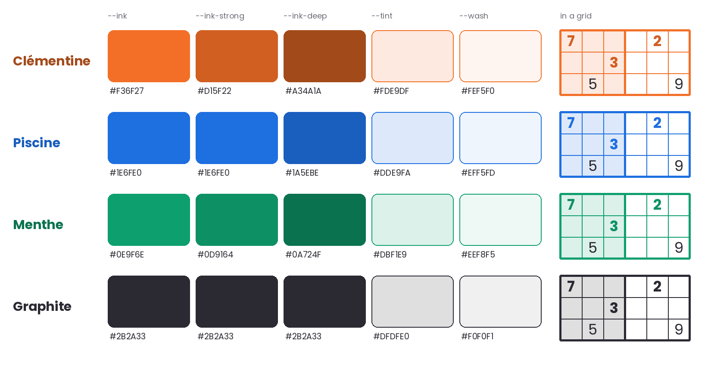
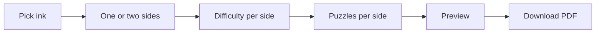

# Sudoku de poche — Design System

Last updated 2026-09-19

## Start here

A design system is the set of decisions you make once so you never make them again: which orange, which font, how thick a grid line, what a button does when pressed. This doc records those decisions for Sudoku de poche, on screen and on paper.

It has three layers, and each layer only uses the one above it.

| Layer      | What it is                                 | Code equivalent                  | Sections                           |
| ---------- | ------------------------------------------ | -------------------------------- | ---------------------------------- |
| Tokens     | Named raw values: colors, sizes, durations | Constants (`--ink`, `--space-3`) | Color, Typography, Space and shape |
| Components | Reusable pieces built only from tokens     | A composable or view with states | The grid, Other components         |
| Patterns   | Screens assembled from components          | A screen or navigation graph     | Patterns, Print spec               |

The token layer is `src/tokens.css`. It is the only file in the app allowed to hold a raw value.

The rule that makes it a system: **no raw values outside the token layer.** A component never says `#F36F27`, it says `--ink`. That one rule is what lets a player recolor a whole notebook by changing three values.

How to use this doc:

1. This tab holds only rules: what things look like and how they behave. Read Principles and Color first; they carry most of the identity.
2. How to make the physical notebook, including the test-print checklist, is in [Print production](print-production.md).
3. Decisions and the build order are in [Project log](project-log.md).

Values marked _proposed_ are my starting points. Values marked _from artwork_ were measured from your cover and puzzle page.

## Principles

The product is a printed object first, and the web app should feel like the same object on a screen. Your four words pull in different directions, so each one gets a job and a limit.

| Word     | What it means here                            | In practice                                                                                                          | The limit                                                 |
| -------- | --------------------------------------------- | -------------------------------------------------------------------------------------------------------------------- | --------------------------------------------------------- |
| Colorful | One ink per surface, many inks across the app | A page, a card or a notebook uses one ink plus its tint. Different areas and notebooks use different inks.           | Never two inks competing inside one grid.                 |
| Fun      | Play lives in scale, tilt and motion          | Oversized numerals, the cover letters rotated -15°, stamps that land with a small bounce.                            | The grid itself never moves, tilts or decorates.          |
| Handmade | It looks printed, not rendered                | Flat ink, no gradients, no blurred shadows. Hard offset shadows like a sticker. Small rotations on labels and cards. | No fake paper textures, no handwriting fonts for content. |
| Design   | Few elements, strict alignment                | Everything sits on the 9-column grid of the puzzle. Generous empty space, like the top of your puzzle page.          | If an element has no job, it goes.                        |

Three tests to run on any new screen:

- **The photocopy test.** Would it still work printed in one ink on white paper? If not, it relies on something the notebook cannot do.
- **The squint test.** Squint at the screen. The puzzle number and the grid should be the two things you still see.
- **The pocket test.** Does it work at A7 size, 74 × 105 mm, or on a small phone held in one hand?

## Color

A theme is one ink chosen by a person, plus five colors derived from it. That is how the system stays colorful while players pick their own notebook colors.

### The theme model

| Token          | Role                                                    | How it is made                                                         | Clémentine value            |
| -------------- | ------------------------------------------------------- | ---------------------------------------------------------------------- | --------------------------- |
| `--ink`        | Grid lines, cover, fills, big shapes, the puzzle number | Chosen                                                                 | `#F36F27` _from artwork_    |
| `--ink-strong` | Given digits, icons, large labels on screen             | `--ink` darkened until it reaches 3:1 on the darkest cell background   | `#D15F22`                   |
| `--ink-deep`   | Small text: labels, seed, links, body on tint           | `--ink` darkened until it reaches 4.5:1 on the darkest cell background | `#A34A1A`                   |
| `--tint`       | Alternate 3×3 boxes, cover letters, selected surfaces   | 15% `--ink` over white                                                 | `#FDE9DF` _matches artwork_ |
| `--wash`       | App background behind cards                             | 7% `--ink` over white                                                  | `#FEF5F0`                   |
| `--on-ink`     | Labels sitting on a solid `--ink` fill                  | Whichever of `--pencil` and `--paper` scores higher against `--ink`    | `--pencil`, at 4.8:1        |

The darkest cell background is `--tint` with the peer overlay on top: `#F0DED5` in Clémentine. Nothing a digit sits on is ever darker than that, so a color that passes there passes everywhere.

`--on-ink` is a theme token, not a fixed one, and a theme that omits it leaves every ink-filled control with no label color at all. It exists because the rule below — the app picks whichever of `--pencil` and `--paper` scores higher on the ink — is a decision CSS cannot make at runtime. Working it out once per theme and storing the answer is what makes the rule real. It covers the primary button, the selected segment of a segmented control, and the number pad's pressed Notes key. It is not for display sizes: `--text-xl` and up on ink use `--tint`, as the cover and the SOLVED sticker do.

Menthe is the honest edge case. `--pencil` on its ink measures 4.19:1, just under the 4.5:1 small text asks for; `--paper` measures 3.39:1, so pencil is the better of the two choices, which is all this rule promises. Every `--on-ink` label today is a control label at `--text-md` or larger. If Menthe ever needs to clear 4.5:1 outright, darken its ink rather than adding a third candidate color.

Why three inks and not one: your orange on white measures 2.95:1. Accessibility guidelines ask for 3:1 on large text and 4.5:1 on small text. On paper this does not matter. On screen it does, so the app darkens the ink only where someone has to read it. Lines, fills and the cover keep the true orange.

Your cover cream measures `#FFEEE6`, about 12% ink. I recommend moving it to `--tint` so the cover and the grid share one value.

### Starter themes



| Theme                | `--ink`   | `--ink-strong` | `--ink-deep` | `--tint`  | `--wash`  | `--on-ink`        |
| -------------------- | --------- | -------------- | ------------ | --------- | --------- | ----------------- |
| Clémentine (default) | `#F36F27` | `#D15F22`      | `#A34A1A`    | `#FDE9DF` | `#FEF5F0` | `--pencil`, 4.8:1 |
| Piscine              | `#1E6FE0` | `#1E6FE0`      | `#1A5EBE`    | `#DDE9FA` | `#EFF5FD` | `--paper`, 4.8:1  |
| Menthe               | `#0E9F6E` | `#0D9164`      | `#0A724F`    | `#DBF1E9` | `#EEF8F5` | `--pencil`, 4.2:1 |
| Graphite             | `#2B2A33` | `#2B2A33`      | `#2B2A33`    | `#DFDFE0` | `#F0F0F1` | `--paper`, 14.2:1 |

The three new inks are _proposed_; adjust them after a test print. Swap any of them and the other four columns recompute. Bonbon (pink) and Prune (violet) were dropped on 18 Sep 2026 and can return later without changing the model.

Yellow is not offered as an ink. At `#F5C518` it reaches 1.6:1 on white, and grid lines disappear. It can come back later as a second accent on covers only.

### Fixed colors

These never change with the theme.

| Token             | Value            | Role                                                                                                                  |
| ----------------- | ---------------- | --------------------------------------------------------------------------------------------------------------------- |
| `--paper`         | `#FFFFFF`        | Page, cards, empty cells                                                                                              |
| `--pencil`        | `#2B2A33`        | Digits the player enters, body text                                                                                   |
| `--pencil-soft`   | `#5C5B66`        | Candidate notes, secondary text. At least 4.5:1 on the darkest cell background of every theme.                        |
| `--correction`    | `#D7263D`        | Conflicts and errors, at digit size only (3.3:1 or better everywhere). Always paired with a shape, never color alone. |
| `--overlay-peer`  | `--pencil` at 6% | Laid over a cell's background in the peer state. The only overlay allowed on a cell.                                  |
| `--opacity-muted` | 0.4              | Disabled buttons, exhausted number keys                                                                               |

### Rules

- One ink per surface. A second ink may appear only as a small, self-contained object: a sticker, a swatch, a thumbnail of another notebook.
- Given digits are ink and bold. Entered digits are pencil and regular weight. Weight carries the difference, so it survives the Graphite theme and color blindness.
- A cell's background is `--paper` or `--tint`, with at most `--overlay-peer` on top. States never add an ink fill to a cell; they use rings and bars instead. This is what keeps digits readable in every state.
- Text on a solid `--ink` background uses `--tint` for display sizes, `--text-xl` and up, as on the cover. Smaller text on ink uses `--on-ink`, which each theme sets to whichever of `--pencil` and `--paper` scores higher on its ink. Never hard-code one of the two: the winner flips between themes, and `--tint` at small sizes fails everywhere (2.5:1 in Clémentine).
- Custom inks from the color picker go through the same computation. If an ink is below 2:1 on white, the picker warns that grid lines may not print well.

```css
:root {
  --paper: #ffffff;
  --pencil: #2b2a33;
  --pencil-soft: #5c5b66;
  --correction: #d7263d;
  --overlay-peer: color-mix(in srgb, var(--pencil) 6%, transparent);
  --opacity-muted: 0.4;
}
[data-theme='clementine'] {
  --ink: #f36f27;
  --ink-strong: #d15f22;
  --ink-deep: #a34a1a;
  --tint: #fde9df;
  --wash: #fef5f0;
  --on-ink: var(--pencil);
}
```

## Typography

Four open-source fonts and one drawn wordmark cover everything. Agdasima, Akatab, Inter and JetBrains Mono are all under the SIL Open Font License 1.1: free to embed on the web, self-host, print and use commercially. The only thing the licence forbids is selling the font files themselves.

| Role     | Token              | Font                                                                                            | Used for                                                     |
| -------- | ------------------ | ----------------------------------------------------------------------------------------------- | ------------------------------------------------------------ |
| Wordmark | none; an SVG asset | Custom-drawn letters, not a font                                                                | The cover, the logo, the home hero. SUDOKU only.             |
| Numeral  | `--font-numeral`   | [Agdasima](https://github.com/docrepair-fonts/agdasima-fonts) Regular; Bold exists for emphasis | Puzzle number, big counts, step numbers in Learn, hero words |
| Label    | `--font-label`     | [Akatab](https://github.com/silnrsi/font-akatab) Bold                                           | NO., difficulty, short uppercase labels, stickers            |
| Text     | `--font-text`      | Inter, variable weight                                                                          | Grid digits, DE POCHE, buttons, body copy                    |
| Code     | `--font-code`      | JetBrains Mono                                                                                  | Seeds, code samples in Learn                                 |

The wordmark is artwork, so it has no font token. Export it once as an SVG with `fill="currentColor"`, and it will take the theme's tint or ink like any other element. Any other large word on a page uses Agdasima.

The seed moves from Inter to JetBrains Mono, decided on 18 Sep 2026. People retype seeds, and v2 will scan them. A mono face keeps look-alike characters apart, and the seed alphabet drops `0 O 1 l I` altogether.

### Scale

Sizes are in rem for screen, with 1 rem = 16 px. Ratio is roughly 1.25, rounded to friendly numbers.

| Token          | Size      | Line height | Font and weight                    | Use                                                |
| -------------- | --------- | ----------- | ---------------------------------- | -------------------------------------------------- |
| `--text-xs`    | 0.75 rem  | 1.4         | Text 500, or Code 400              | Seed, captions                                     |
| `--text-sm`    | 0.875 rem | 1.4         | Label 700, uppercase, +6% tracking | Labels such as NO. and MEDIUM                      |
| `--text-md`    | 1 rem     | 1.55        | Text 400                           | Body                                               |
| `--text-lg`    | 1.25 rem  | 1.4         | Text 600                           | Card titles, lead paragraphs                       |
| `--text-xl`    | 2 rem     | 1.15        | Text 700                           | Page titles                                        |
| `--display-md` | 4.5 rem   | 0.9         | Numeral 400                        | Puzzle number on Play                              |
| `--display-lg` | 7.5 rem   | 0.85        | Numeral 700                        | Hero word on a page, when the wordmark is not used |

Weights are tokens too: `--weight-regular` 400, `--weight-medium` 500, `--weight-semibold` 600, `--weight-bold` 700. Text sizes (`--text-*`) are for reading; display sizes (`--display-*`) are for showing a few characters large. That is why there are two prefixes.

### Digits in the grid

- `--digit-scale` is 0.8: a digit's `font-size` is 0.8 × the cell size, which makes the digit 58% of the cell high _from artwork_.
- `--note-scale` is 0.28: candidate notes are 28% of the cell size.
- Always `font-variant-numeric: tabular-nums lining-nums`, so every digit has the same width and sits on the same line. Inter supports both.
- Given digits: Inter `--weight-bold` in `--ink-strong`. Entered digits: Inter `--weight-regular` in `--pencil`. Notes: Inter `--weight-medium` in `--pencil-soft`.
- Self-host the four fonts as WOFF2 and subset them. Agdasima only needs digits and a few capitals; Akatab only needs Latin capitals. The Tifinagh glyphs in Akatab can go.

### Rules

- Wordmark and Numeral are for a few characters at a time. Never a sentence.
- Uppercase is for labels of one or two words only.
- Only the wordmark rotates. Text blocks stay horizontal.

## Space, shape and motion

The grid is rigid and square; everything around it is soft, slightly tilted and stamped on. These tokens encode that contrast.

### Spacing

One scale on a 4 px base. Pick from it; never type another number.

| Token | `--space-1` | `--space-2` | `--space-3` | `--space-4` | `--space-5` | `--space-6` | `--space-7` | `--space-8` |
| ----- | ----------- | ----------- | ----------- | ----------- | ----------- | ----------- | ----------- | ----------- |
| px    | 4           | 8           | 12          | 16          | 24          | 32          | 48          | 64          |

Inside a component use 1 to 4. Between components use 4 to 6. Between page sections use 7 and 8. The large empty band at the top of your puzzle page is this idea at print scale: keep it.

### Sizes, breakpoint and layers

| Token             | Value  | Use                                                                                         |
| ----------------- | ------ | ------------------------------------------------------------------------------------------- |
| `--size-cell-min` | 36 px  | Smallest playable cell                                                                      |
| `--size-target`   | 44 px  | Minimum height of buttons and other touch targets                                           |
| `--size-key`      | 48 px  | Minimum size of a number pad key                                                            |
| `--size-grid-max` | 540 px | Widest the grid ever gets                                                                   |
| `--bp-wide`       | 900 px | The single breakpoint: below it, one column; above it, the number pad moves beside the grid |
| `--layer-sticker` | 10     | Stickers and stamps over content                                                            |
| `--layer-bar`     | 100    | Top bar and bottom tab bar                                                                  |
| `--layer-dialog`  | 1000   | Dialogs and their backdrop                                                                  |

CSS cannot read a custom property inside a media query, so `--bp-wide` is written as `900px` there, with a comment naming the token.

### Lines

| Token         | Screen | Print (A7) | Use                                                                     |
| ------------- | ------ | ---------- | ----------------------------------------------------------------------- |
| `--line-cell` | 1 px   | 0.7 pt     | Lines between cells                                                     |
| `--line-box`  | 3 px   | 1.45 pt    | Lines between 3×3 boxes and around the grid; the current-page underline |
| `--line-ui`   | 2 px   | n/a        | Borders of buttons, cards, inputs; the dashed hint ring                 |
| `--line-ring` | 3 px   | n/a        | Selection ring, same-digit bar, focus ring, selected-swatch ring        |
| `--line-gap`  | 2 px   | n/a        | Paper gap between an element and its ring                               |

Print values are _from artwork_: 3 px and 6 px at 300 dpi, a ratio of 1 to 2. Do not go below 0.35 pt in print, or a home printer may drop the line.

### Shape

| Token           | Value  | Use                                    |
| --------------- | ------ | -------------------------------------- |
| `--radius-none` | 0      | The grid and its cells. Always square. |
| `--radius-sm`   | 6 px   | Number pad keys, inputs, tags          |
| `--radius-md`   | 14 px  | Cards, dialogs                         |
| `--radius-pill` | 999 px | Buttons, swatches                      |
| `--tilt-sm`     | -2°    | Stickers, tags, notebook thumbnails    |
| `--tilt-cover`  | -15°   | The wordmark only _from artwork_       |

### Shadows

Shadows are hard and offset, like a second layer of ink printed slightly off. No blur anywhere.

| Token              | Value                  | Use                                                                            |
| ------------------ | ---------------------- | ------------------------------------------------------------------------------ |
| `--shadow-rest`    | `4px 4px 0 var(--ink)` | Buttons, cards you can act on                                                  |
| `--shadow-hover`   | `6px 6px 0 var(--ink)` | Same, under the pointer                                                        |
| `--shadow-pressed` | `1px 1px 0 var(--ink)` | Same, while pressed; the element also moves down and right by `--press-offset` |
| `--press-offset`   | 3 px                   | The distance a pressed element travels                                         |

The grid never has a shadow. Static content never has a shadow. A shadow means you can press this.

### Motion

| Token           | Value                               | Use                                        |
| --------------- | ----------------------------------- | ------------------------------------------ |
| `--dur-fast`    | 120 ms                              | Press, select a cell, key feedback         |
| `--dur-base`    | 200 ms                              | Hover, tabs, panels                        |
| `--dur-slow`    | 450 ms                              | Puzzle solved stamp, page transitions      |
| `--ease-out`    | `cubic-bezier(0.2, 0, 0, 1)`        | Default                                    |
| `--ease-stamp`  | `cubic-bezier(0.34, 1.56, 0.64, 1)` | Things that land: digits, stamps, stickers |
| `--stamp-scale` | 1.3                                 | The size a landing element starts from     |

A digit placed by the player scales from `--stamp-scale` to 1 with `--ease-stamp` in `--dur-fast`. Under `prefers-reduced-motion`, every animation becomes a plain `--dur-fast` fade.

## The grid

One grid component serves all three areas of the app and the printed page. Build it once, with three variants, and the screen and the notebook can never drift apart.

### Anatomy

- 81 square cells in 9 boxes of 3×3.
- Boxes alternate `--paper` and `--tint` in a checkerboard. The four edge-centre boxes are tinted; the corners and the centre are paper _from artwork_.
- `--line-cell` between cells, `--line-box` between boxes and around the outside, both in `--ink`.
- Square corners, no shadow, never rotated.

### Variants

| Variant  | Use when                                                | Differences                                                                                               |
| -------- | ------------------------------------------------------- | --------------------------------------------------------------------------------------------------------- |
| `play`   | The Play screen                                         | Interactive, all states below, keyboard and touch input                                                   |
| `static` | Learn illustrations, notebook thumbnails, the home page | Not focusable. Accepts a list of cells to highlight and an optional step caption                          |
| `print`  | The notebook PDF                                        | Given digits in `--ink` instead of `--ink-strong`. Line weights in pt. No states. See Print variant below |

### Properties

| Property        | Type                      | Default   | Description                                                |
| --------------- | ------------------------- | --------- | ---------------------------------------------------------- |
| `puzzle`        | string of 81 characters   | required  | Givens, `0` or `.` for empty                               |
| `variant`       | `play`, `static`, `print` | `play`    | See above                                                  |
| `theme`         | theme name or custom ink  | inherited | Sets the five theme tokens on the grid's root              |
| `highlight`     | list of cell indexes      | empty     | `static` only. Cells drawn in the peer or same-digit state |
| `showConflicts` | boolean                   | `true`    | `play` only. Turn off for a purist mode                    |

### Cell states

| State      | Visual                                                                           | Notes                                                                                     |
| ---------- | -------------------------------------------------------------------------------- | ----------------------------------------------------------------------------------------- |
| Empty      | Box background only                                                              |                                                                                           |
| Given      | Digit in `--weight-bold`, `--ink-strong`                                         | Cannot be edited                                                                          |
| Entered    | Digit in `--weight-regular`, `--pencil`                                          | Lands with the stamp animation                                                            |
| Notes      | Up to 9 small digits in a 3×3 layout, `--pencil-soft`, sized by `--note-scale`   | Digit n always sits in position n                                                         |
| Selected   | `--line-ring` inset ring in `--ink`                                              | The ring works on paper and on tint                                                       |
| Peer       | `--overlay-peer` over the box background                                         | Same row, column and box as the selection                                                 |
| Same digit | `--line-ring` bar in `--ink` along the bottom of the cell, inside the cell lines | Every cell showing the selected digit. A bar, not a fill, so the digit keeps its contrast |
| Conflict   | Digit turns `--correction`, plus a small filled triangle in the top-right corner | The triangle is the non-color cue                                                         |
| Hint       | `--line-ui` dashed inset ring in `--ink-deep`                                    | From the Learn area or a hint button                                                      |
| Solved     | All digits switch to `--ink-strong`; a tilted stamp lands over the grid          | Grid becomes read-only                                                                    |

Priority when states overlap: selected, then conflict, then hint, then same digit, then peer.

**The selected empty cell is a special case of Notes.** In `play` it becomes nine toggle targets, one per digit, so a note can be set by pointing at where it will appear. Only the set ones are drawn. The other slots are present and focusable but fully transparent, because nine faint digits in a 3×3 layout is exactly what a cell with all nine notes looks like, and every selected cell would read that way. They come up at `--opacity-muted` while the pointer is anywhere in the cell, and to full opacity under the pointer or the keyboard — a focused slot never uses `--opacity-muted`, because `opacity` composites the focus ring too and would drop it to about 2.3:1.

### Size

- Width is the smaller of the container and `--size-grid-max`. Cells are always square.
- Minimum cell size on screen is `--size-cell-min`. That fits a 360 px wide phone with `--space-4` margins and keeps a comfortable touch target.
- Below `--size-cell-min` the grid is `static` only.

### Accessibility

- **Role**: `grid`, with `row` and `gridcell` children. One tab stop for the whole grid; the selected cell holds focus.
- **Keyboard**: arrows move, `1` to `9` enter a digit, `Backspace`, `Delete` or `0` clear, `N` toggles notes mode, `Escape` deselects.
- **Screen reader**: each cell is announced as "Row 3, column 4, 7, given", or "empty", or "5, conflict". Given cells carry `aria-readonly`. Conflicts carry `aria-invalid`. Completion is announced through a polite live region.

### Do and don't

| Do                                                   | Don't                                                      |
| ---------------------------------------------------- | ---------------------------------------------------------- |
| Let the grid take the full width on phones           | Put the grid inside a card with its own border and shadow  |
| Use `static` with `highlight` to explain a technique | Draw arrows or circles on top of the grid in another color |
| Keep the checkerboard tint in every variant          | Use tint to show selection. It already means box           |

### Skeleton

```html
<div
  class="sdp-grid"
  role="grid"
  data-variant="play"
  data-theme="clementine"
  aria-label="Sudoku 001, medium"
>
  <div role="row">
    <div
      role="gridcell"
      class="sdp-cell"
      data-box="tint"
      data-state="given"
      aria-readonly="true"
      aria-label="Row 1, column 8, 2, given"
    >
      2
    </div>
    <!-- 8 more cells -->
  </div>
  <!-- 8 more rows -->
</div>
```

```css
.sdp-grid {
  display: grid;
  gap: 0;
  width: min(100%, var(--size-grid-max));
  aspect-ratio: 1;
  border: var(--line-box) solid var(--ink);
}
.sdp-cell {
  font: var(--weight-bold) calc(var(--cell) * var(--digit-scale)) / 1 var(--font-text);
  font-variant-numeric: tabular-nums lining-nums;
  color: var(--ink-strong);
  background: var(--paper);
}
.sdp-cell[data-box='tint'] {
  background: var(--tint);
}
.sdp-cell[data-state='entered'] {
  font-weight: var(--weight-regular);
  color: var(--pencil);
}
.sdp-cell[data-peer] {
  background-image: linear-gradient(var(--overlay-peer), var(--overlay-peer));
}
.sdp-cell[data-same] {
  box-shadow: inset 0 calc(var(--line-ring) * -1) 0 var(--ink);
}
.sdp-cell[aria-selected='true'] {
  box-shadow: inset 0 0 0 var(--line-ring) var(--ink);
}
```

### Print variant

Built 19 Sep 2026, in `src/print.css`. It departs from the skeleton above in two ways, both forced by physical units.

**Lines are gaps, not borders.** The print grid is a 3×3 of 3×3 grids over an `--ink` background: the lines are the ink showing through `gap`. Borders do not work at these weights, because a 1.45 pt border takes its width from the column it sits on and leaves the three boxes unequal by about 0.26 mm — visible against a ruler, and the test print asks for a ruler. A gap takes its width from the whole, so every cell pitch is identical.

**Type is sized by cap height,** because that is what a ruler measures and what the Print spec records. Each rule pairs `font-size: calc(<target> / var(--cap-ratio))` with `font-size-adjust: cap-height var(--cap-ratio)`, which forces the capitals to `<target>` whatever face actually loads, and `text-box: trim-both` makes the margins between them measured distances rather than distances plus half-leading. Both are Chromium-only today; elsewhere the page still prints, a few tenths of a millimetre loose.

The pt line weights belong to the variant, not to `@media print`: the Print screen previews a print grid on a monitor and it has to measure the same there.

## Other components

Eleven more components cover the whole app. Each gets one row here; when you build one, expand it using the same headings as The grid.

| Component         | What it is                                              | Variants                                                                                   | Key states                                                                                  | Tokens and notes                                                                                                                                                    |
| ----------------- | ------------------------------------------------------- | ------------------------------------------------------------------------------------------ | ------------------------------------------------------------------------------------------- | ------------------------------------------------------------------------------------------------------------------------------------------------------------------- |
| Button            | Pill with `--line-ui` border and a hard shadow          | `primary` (ink fill), `secondary` (paper fill, ink border), `quiet` (text only, no shadow) | Rest, hover, pressed, focus, disabled, loading                                              | Shadows as in Space, shape and motion. Disabled loses its shadow and drops to `--opacity-muted`. Label in Text `--weight-semibold`. Minimum height `--size-target`. |
| Number pad        | Keys 1 to 9, erase, notes toggle, undo                  | `row` on wide screens, `3x3` on phones                                                     | Rest, pressed, exhausted (all nine placed: key drops to `--opacity-muted`), notes mode on   | Keys are `--radius-sm`, `--size-key` minimum. Each key shows the count left in `--text-xs`.                                                                         |
| Puzzle number     | The NO. label over a three-digit numeral                | `md` on Play, `sm` in lists, `print`                                                       | None                                                                                        | NO. in Akatab Bold at `--text-sm`, numeral in `--font-numeral`, both `--ink`. Always zero-padded to three digits.                                                   |
| Difficulty tag    | EASY, MEDIUM, HARD, EXPERT                              | `text` as in your artwork, `pips` adds one to four filled squares                          | None                                                                                        | `--text-sm`, `--ink-deep` on screen, `--ink` in print. Difficulty is never shown by color, because the notebook's color belongs to the player.                      |
| Seed label        | The seed under the grid, with a copy action             | `screen` (copy button), `print`                                                            | Rest, copied                                                                                | `--font-code`, `--text-xs`, `--ink-deep`. Alphabet excludes 0 O 1 l I. Right-aligned to the grid edge _from artwork_.                                               |
| Sticker           | A small tilted label: NEW, SOLVED, a streak count       | `solid`, `outline`                                                                         | Lands with `--ease-stamp`                                                                   | `--tilt-sm`, `--radius-sm`, ink fill with tint text at large size. The main carrier of the handmade feel; use at most one per view.                                 |
| Card              | A container for a notebook, a lesson or a saved game    | `static`, `action` (whole card is a link)                                                  | `action`: rest, hover, pressed, focus                                                       | `--paper` on `--wash`, `--line-ui` border, `--radius-md`. Only `action` cards get a shadow.                                                                         |
| Swatch picker     | Choose a theme or a custom ink                          | `themes` (four circles), `custom` (adds a color input)                                     | Rest, selected (`--line-ring` ink ring with a `--line-gap` paper gap), low-contrast warning | Each swatch has a text name for screen readers. Selecting one previews the notebook live.                                                                           |
| Segmented control | Pick one of a few options: difficulty, one or two sides | 2 to 4 segments                                                                            | Rest, selected (ink fill), focus, disabled                                                  | Behaves as a radio group. Arrow keys move the choice.                                                                                                               |
| Stepper           | Number of puzzles per side                              | None                                                                                       | Rest, min reached, max reached                                                              | Minus and plus buttons around a Numeral-font value.                                                                                                                 |
| Top bar           | Wordmark plus three links: Play, Learn, Print           | `wide`, `compact` (bottom tab bar on phones)                                               | Current page: `--line-box` ink underline                                                    | The wordmark in the bar is horizontal; the -15° tilt is kept for the cover and the home hero.                                                                       |

Puzzle number, difficulty tag and seed label share one stylesheet, `src/components.css`. It is not a `variant` prop like the grid's: the same markup is reused at both sizes, and a `data-size` attribute on an ancestor picks the rules — `md` for the Play screen, `print` for the notebook page, sized by cap height as in Print variant above.

### Button

Built 19 Sep 2026, in `src/play.css`.

**Anatomy.** A pill: `--radius-pill`, a `--line-ui` border in `--ink`, a label in Text `--weight-semibold` at `--text-md`, `--space-2` by `--space-5` of padding, and a minimum height of `--size-target`. The hard offset shadow is the whole affordance — it is what says you can press this.

| Variant     | Fill      | Border      | Shadow | Use                                   |
| ----------- | --------- | ----------- | ------ | ------------------------------------- |
| `primary`   | `--ink`   | `--ink`     | Yes    | The one primary action on a screen    |
| `secondary` | `--paper` | `--ink`     | Yes    | Everything else that is a real action |
| `quiet`     | None      | Transparent | No     | Low-stakes actions: New game, Cancel  |

`primary` takes its label from `--on-ink`; `secondary` and `quiet` use `--ink-deep`.

| State    | What changes                                                                   |
| -------- | ------------------------------------------------------------------------------ |
| Rest     | `--shadow-rest`                                                                |
| Hover    | `--shadow-hover`. `quiet` underlines its label instead, having no shadow       |
| Pressed  | `--shadow-pressed`, and the button translates by `--press-offset` on both axes |
| Focus    | The standard ring below, over whatever else is showing                         |
| Disabled | Shadow removed, `--opacity-muted`, `cursor: default`                           |
| Loading  | Not built. Generation shows its wait in the message line, not on a button      |

The shadow and translate transition over `--dur-fast` with `--ease-out`, inside a `prefers-reduced-motion: no-preference` guard.

**Accessibility.** A real `<button>` with a `type`. `--size-target` is the floor for the whole hit area, not just the text. Disabled uses the `disabled` attribute, so the button leaves the tab order rather than being a trap. The label is a verb.

**Do and don't.** One `primary` per screen. Never use `quiet` for a destructive action — without a shadow it does not read as pressable enough for a decision you cannot undo.

### Number pad

Built 19 Sep 2026, in `src/number-pad.css` and `src/ui/number-pad.ts`.

**Anatomy.** Twelve keys: 1 to 9, then Erase, Notes and Undo. Each key is `--radius-sm`, a `--line-ui` border in `--ink` on `--paper`, a label in Text `--weight-semibold`, and at least `--size-key` in both directions. `--space-2` between keys. Digit keys carry a count in the top-right corner at `--text-xs` and `--weight-regular`: how many of that digit are left to place, givens included. Utility keys drop to `--text-sm`, because their labels are words.

| Variant | When                  | Layout                                                      |
| ------- | --------------------- | ----------------------------------------------------------- |
| `3x3`   | Below `--bp-wide`     | Three columns under the grid: 1-9, then the three utilities |
| `row`   | At `--bp-wide` and up | Four columns beside the grid, aligned to its top edge       |

| State         | Visual                                                                   |
| ------------- | ------------------------------------------------------------------------ |
| Rest          | Paper fill, ink border                                                   |
| Pressed       | The key's own press feedback; the digit lands in the cell with the stamp |
| Exhausted     | All nine placed: `--opacity-muted`, `cursor: default`, and `disabled`    |
| Notes mode on | The Notes key fills with `--ink` and takes `--on-ink` for its label      |
| Undo empty    | `disabled` while there is nothing to undo                                |
| Focus         | The standard ring below                                                  |

**Behaviour.** The pad is the pointer half of one input model; the keyboard is the other, and both run through the same state transitions. Notes mode is one flag: with it on, a digit key toggles an annotation instead of placing. Exhausted is computed, never set — it falls out of the remaining count reaching zero, which is also what makes a solved grid's digit keys disable themselves.

**Accessibility.** Real buttons. Each digit key is labelled "5, 4 left", so the count is announced and not just seen. The Notes key is a toggle and carries `aria-pressed`. Exhausted and empty-undo keys use `disabled`.

**Do and don't.** Keep the count on the key; it is the one piece of progress the screen shows, and it replaces a timer. Do not reorder the keys by what is left — a number pad people reach for without looking must not move.

### Focus, everywhere

Every interactive element shows the same focus ring: a `--line-ring` outline in `--pencil` with a `--line-gap` gap in `--paper`. Pencil, not ink, so it is visible on ink-filled buttons and stays the same in every theme.

### Naming

- CSS classes: `sdp-` prefix, then the component, then a modifier. `sdp-button`, `sdp-button--primary`.
- Tokens: category first, then role or step. `--space-4`, `--line-box`, `--dur-fast`.
- Color tokens are the one exception. They are named after materials, with no prefix: `--ink`, `--tint`, `--wash`, `--paper`, `--pencil`, `--correction`. A material name says what the color is for, which a prefix would not.
- Steps: numbers for a long scale (`--space-1` to `8`), sizes for a short one (`--radius-sm`, `--text-lg`), words for roles (`--dur-fast`, `--ease-stamp`). Zero is `none`.
- States go in `data-state` or the matching ARIA attribute, never in a class name.
- Words: the area of the app is Print; the object it makes is a notebook, _carnet_ in French. Booklet is not used.

## Patterns

The app has three areas, and each one is the puzzle page rearranged: a big number, a label, a grid, a seed. Reusing that layout is what makes the app feel like the notebook.

| Area  | Job                                | Ink                             | Main components                                                             |
| ----- | ---------------------------------- | ------------------------------- | --------------------------------------------------------------------------- |
| Play  | Solve one grid in the browser      | Clémentine, or the player's own | Grid `play`, number pad, puzzle number, difficulty tag, seed label, sticker |
| Learn | Understand how grids are generated | Piscine                         | Grid `static`, stepper, code blocks, cards                                  |
| Print | Compose and download a notebook    | The notebook's ink, live        | Swatch picker, segmented control, stepper, grid `print` preview, button     |

### Play

- Layout copies the printed page: puzzle number top left, difficulty tag right-aligned on the grid's top edge, grid, seed right-aligned under it.
- The number pad sits under the grid on phones and to the right above `--bp-wide`.
- Nothing else is on the screen while playing. Timer, settings and new-game live behind one quiet button.
- Solving a puzzle lands a SOLVED sticker over the grid. That is the one big moment of fun in the app; keep every other animation small.

### Learn

- One idea per step: a short paragraph, then a `static` grid that shows it, then the next step. Text column is 60 characters wide at most.
- Steps are numbered in the Numeral font, the same way puzzles are.
- Grids in lessons use `highlight` to point at cells. Explanations never rely on color words alone: say "the shaded cells in row 3".
- Code samples use `--font-code` on `--wash`, with a `--line-ui` left border in `--ink`.

### Print



All five choices sit on one screen, with the preview updating live beside them. The preview shows the cover and one puzzle page at true A7 proportions, drawn by the same grid component in its `print` variant.

### Shared rules

- One primary button per screen.
- Empty states use a `static` grid with no digits and one sentence, not an illustration.
- Errors say what happened and what to do next, in a sentence, next to the thing that failed.
- The interface ships in French and English. Proper names stay French in both: Sudoku de poche, Clémentine, Piscine, Menthe, Graphite.
- Handmade stops at flat ink, hard shadows, tilt and stickers. No hand-drawn illustration for now.

## Print spec

The printed page is the reference design, and the screen follows it. Print uses the same tokens with physical units: mm for layout, pt for lines and type.

### Tokens

The values in the tables below were measured before they were named. These are their token names, added 19 Sep 2026.

| Token                    | Value              | Role                                                  |
| ------------------------ | ------------------ | ----------------------------------------------------- |
| `--page-w`, `--page-h`   | 74 mm, 105 mm      | The trim                                              |
| `--page-bleed`           | 3 mm               | Cover only. A puzzle page has none                    |
| `--page-safe`            | 4 mm               | Left, right and bottom                                |
| `--page-binding`         | 12 mm              | Top. Nothing printed                                  |
| `--print-grid`           | 65.4 mm            | The grid, centred on the trim                         |
| `--cell`                 | `--print-grid` ÷ 9 | Cell pitch                                            |
| `--print-gap`            | 2.2 mm             | Grid to seed, and number to grid                      |
| `--cap-ratio`            | 0.72               | The cap-height metric every print size is set against |
| `--print-cap-number`     | 10.6 mm            | Puzzle number, cap height                             |
| `--print-cap-label`      | 2 mm               | NO. and difficulty, cap height                        |
| `--print-seed`           | 5.5 pt             | Seed                                                  |
| `--sheet-w`, `--sheet-h` | 210 mm, 297 mm     | The A4 sheet pages are imposed on at home             |

The 4.2 mm given digit has no token: it falls out of `--digit-scale` against the cell, the same mechanism the screen uses, and a second source for one measurement is how a print spec drifts.

The trimmed page is A7, 74 × 105 mm. The web app's generated page is the source of truth for the puzzle page; the Figma puzzle page was a sketch. Values marked _from artwork_ were measured on that sketch at 300 dpi and are the generator's starting values. File set-up and the test print are in [Print production](print-production.md).

### Page zones

| Zone         | Size                                                      | What goes there                                                                                                    |
| ------------ | --------------------------------------------------------- | ------------------------------------------------------------------------------------------------------------------ |
| Trim         | 74 × 105 mm                                               | The finished page                                                                                                  |
| Bleed        | 3 mm beyond the trim on all four sides; frame 80 × 111 mm | Only artwork that touches the edge: the cover's orange and its cropped letters. The puzzle page has nothing in it. |
| Safe zone    | 4 mm inside the trim on the left, right and bottom        | Everything that must survive trimming: grid, seed, labels                                                          |
| Binding zone | 12 mm inside the trim at the top                          | Nothing. The wire-o holes go here. Confirm the depth with whoever punches.                                         |

The grid is centred on the trim, not on the frame. With equal bleed on both sides that is the same thing.

### Puzzle page

| Element            | Value                                                                                                                                   | Source                                                  |
| ------------------ | --------------------------------------------------------------------------------------------------------------------------------------- | ------------------------------------------------------- |
| Page               | 74 × 105 mm, portrait, bound on the top short edge                                                                                      | Your spec                                               |
| Binding zone       | Top 12 mm (142 px), nothing printed                                                                                                     | Your choice; confirm with whoever punches the wire-o    |
| Safe margins       | 4 mm (47 px) left, right and bottom                                                                                                     | Your choice                                             |
| Grid               | 65.4 × 65.4 mm (772 px), cells 7.3 mm (86 px), centred on the page                                                                      | _from artwork_, centring is new                         |
| Given digits       | 4.2 mm high (50 px), Inter 700 at about 69 px, `--ink`                                                                                  | _from artwork_                                          |
| Puzzle number      | Agdasima Regular, 10.6 mm high (125 px), left-aligned to the grid                                                                       | _from artwork_                                          |
| NO. and difficulty | Akatab Bold, capitals about 2 mm high, baseline of the difficulty aligned with the numeral's base                                       | _from artwork_                                          |
| Seed               | JetBrains Mono, 5.5 pt (23 px) minimum, full `--ink`, right-aligned to the grid. Its lowest point sits on the safe bottom line, y 1228. | Artwork has it at about 60% ink and below the safe line |
| Lines              | 0.7 pt cell (3 px), 1.45 pt box (6 px)                                                                                                  | _from artwork_                                          |
| Gap grid to seed   | 2.2 mm (26 px)                                                                                                                          | _from artwork_                                          |

The empty band between the binding and the puzzle number is deliberate. It is where a thumb holds the notebook and where people scribble.

### Cover

- Full-bleed `--ink` with the wordmark in `--tint`, rotated -15° and cropped by the page edges _from artwork_.
- DE POCHE in Text 500, uppercase, tracked, rotated with the wordmark and tucked inside the last U.
- Add 3 mm bleed on every side, or the orange will show white slivers after trimming.
- Keep the wire-o holes in mind: the top 12 mm of the cover will be punched through the S and the U. That suits the cropped look, but check it on a test print.

### Two-sided notebooks

- Side A on rectos, side B on versos. Both sides have the binding zone at the top, so print duplex with a flip on the long edge.
- Side B starts again at NO. 001 and carries its own difficulty tag.
- The back cover is the front cover of side B. It can use the same ink or a second one; this is the one place two inks meet in one object.

### Screen to paper

| On screen                       | On paper                                                                                         |
| ------------------------------- | ------------------------------------------------------------------------------------------------ |
| `--ink-strong` for given digits | `--ink`. Contrast rules for screens do not apply, and the true ink looks better                  |
| `--wash` background             | Nothing. The paper is the background                                                             |
| Shadows, hover, focus           | Removed                                                                                          |
| px and rem                      | mm and pt                                                                                        |
| `--tint` at 15%                 | The same 15% tint. On an office printer check it is still visible; raise to 20% if it washes out |
